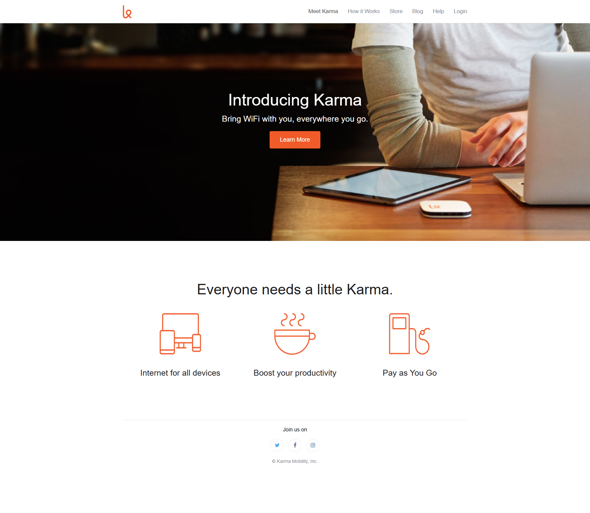

# Karma Landing Page Clone

A responsive landing page clone of the Karma WiFi website built as part of a Front-End Web Development project.  
This project focuses on layout structure, semantic HTML, CSS styling, and responsive design principles.

---

## 🔗 Live Demo

👉 https://edaviesc.github.io/fewd_landing_page_clone/

---

## 📸 Website Preview



---

## 📌 Project Overview

This project recreates the "Karma" landing page interface, emphasizing:

- Clean layout structure
- Hero section with call-to-action
- Navigation bar with aligned menu items
- Icon feature section
- Footer with social media links
- Responsive design fundamentals

The goal was to practice building a modern landing page using foundational front-end technologies.

---

## 🛠️ Built With

- HTML5  
- CSS3  
- Responsive Design Principles  
- Git & GitHub Pages  

---

## 🎯 Key Features

- Hero banner with overlay text
- Clear call-to-action button
- Three-column feature section
- Simple and elegant typography
- Clean visual hierarchy
- Mobile-friendly structure

---

## 📂 Project Structure
```plaintext
fewd_landing_page_clone/
│
├── index.html
├── css/
│ └── style.css
├── images/
│ └── (assets)
└── README.md
```

---

## 🚀 What I Practiced

- Structuring semantic HTML
- CSS positioning and layout
- Using flexbox for alignment
- Creating visual balance
- Organizing project files
- Deploying via GitHub Pages

---

## 📈 Future Improvements

- Add mobile-first refinements
- Improve accessibility (ARIA roles, contrast adjustments)
- Add subtle animations
- Optimize performance

---

## 👨‍💻 Author

**Emlyn Davies-Cole**  
Front-End Developer | Designer  

GitHub: https://github.com/edaviesc  

---

## 📄 License

This project is open-source and available for learning and educational purposes.
